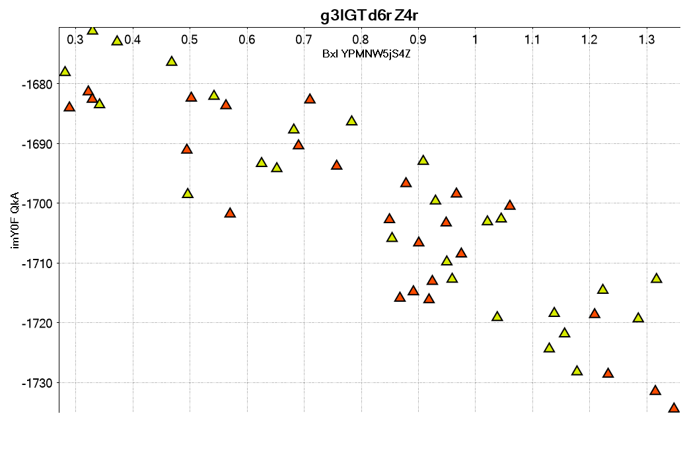

# Generate Random Scatter Plots

Tool to generate random scatter plots with their ground truth in C# using [OxyPlot](https://github.com/oxyplot/oxyplot). Based on the [scatteract project](https://github.com/bloomberg/scatteract).
- Image outputted in png and pdf.
- Ground truth are outputted in [__Pascal VOC xml format__](https://www.microsoft.com/en-us/research/wp-content/uploads/2016/02/PascalVOC_IJCV2009.pdf). Example of Pascal VOC file for the scatter plot below [__here__](GenerateRandomScatter/Examples/plot_15.xml).
- Available classes are _point_, _tick_ and _label_.
- [OxyPlot](https://github.com/oxyplot/oxyplot) models are saved in json. Example for the scatter plot below [__here__](GenerateRandomScatter/Examples/plot_15_model.json).

## Scatter plot generated

## Scatter plot with the bounding boxes

